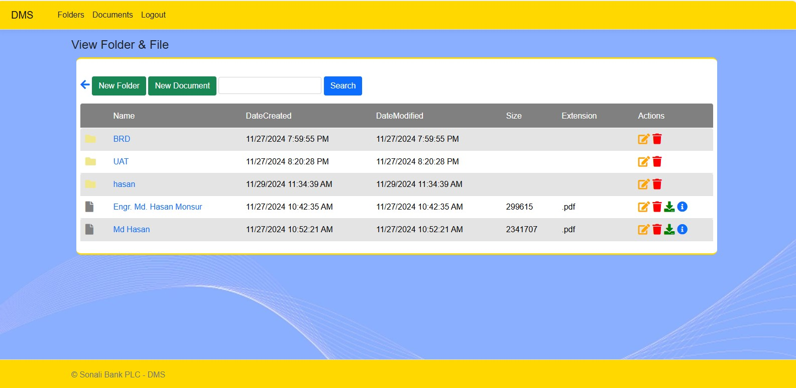

# DMS Project

A Document Management System made with ASP.NET8 MVC

https://medium.com/@hasanmcse/how-to-build-a-complete-document-management-system-a-step-by-step-guide-7b3e583e8c3b

https://github.com/gtechsltn/Document-Management-System

https://medium.com/@hasanmcse/postgresql-as-a-document-database-with-net-features-benefits-and-use-cases-c575dbcc76cd

https://github.com/gtechsltn/PostgreSQL-as-a-Document-Database

# About

This project is lightweight and use full of your document management system. it has user authentication and authorization, document upload, document search, document download, document. it also has user role management and document categorization. it is a simple and easy to use document management system. it is made with ASP.NET CORE MVC.  

# Features

- user login & management
- access authentication & authorization
- division and department wise access
- Manage Folders
- Manage Files and support any extension of file
- Download and edit files with a single click

 

# Database migration 
 dotnet ef migrations add MigrationName
 dotnet ef database update

